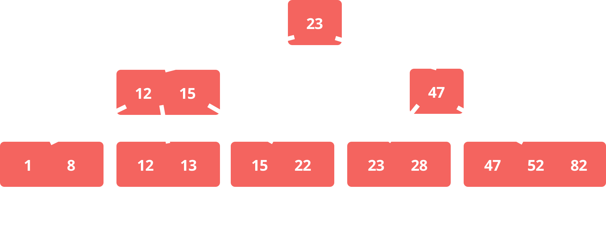
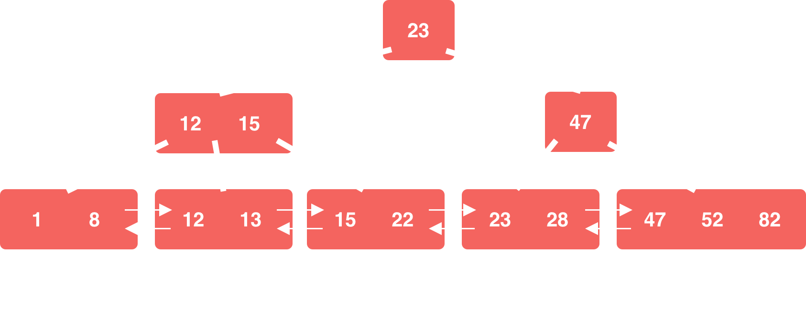
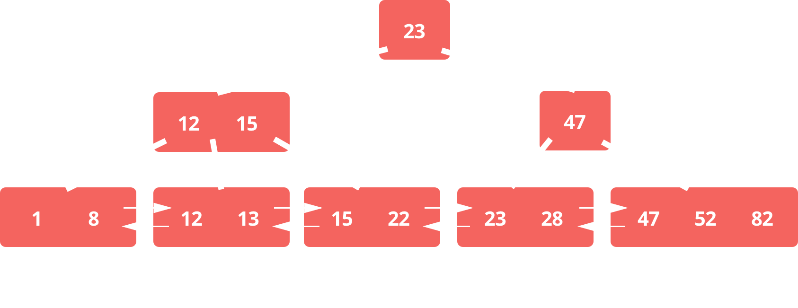
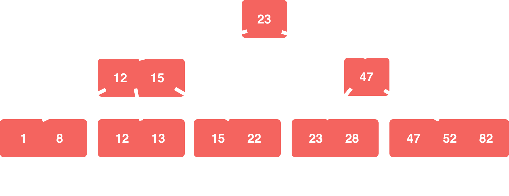
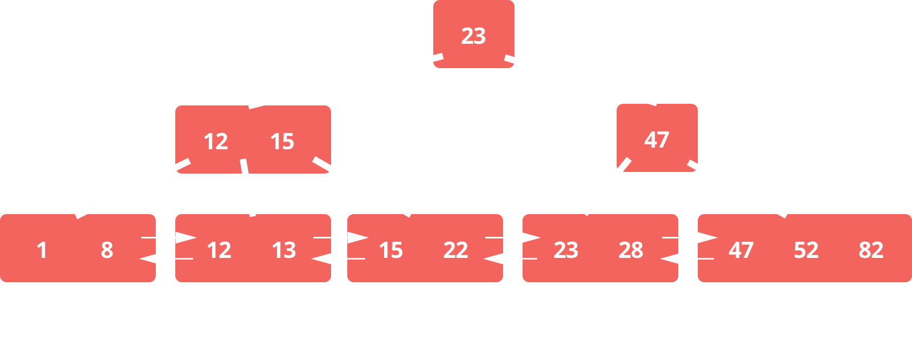

build-lists: true

## Things every developer absolutely, positively needs to know about _**database indexing**_

---

# Why _**indexing**_?

---


# Why _**indexing**_?

- Improve query performance
- ...
- That's about it

---
^ - Everyone should now them, right?


# [fit] _**Slow Queries**_
# [fit] Are one the most common causes of 
# [fit] poor performance

---
^ - There's a lot more to indexes
- No good literature for devs
- ORMS abstract everything

# [fit] Developers 
# [fit] don't know (enough)
# [fit] about _**indexing**_

---


# What we will learn

---


# What we will learn

1. What's an index?
1. How to create an index?
1. Understanding the execution plan
1. Common pitfalls

---

# What's an _**index?**_

---

> An index is an ordered representation of the indexed data

---


---


---

# B-Tree

---
^ Each branch node entry corresponds to the biggest value in the respective leaf node.



---
^ Doubly linked list



---



---



---



---

^ - What data is on the index?
- Fast even for huge datasets
- Same number of steps for all elements

- Searching for a value is fast 
- Logarithmic scalability
- Tree depth grows very slowly compared to number of leaf nodes 

---

# [fit] Indexing makes 
# [fit] reading _**faster**_
# [fit] but writing _**slower**_

---

# How to create an _**index**_

---

```sql
CREATE INDEX index_name 
          ON table_name (column_name)
```

---

```sql
CREATE INDEX index_name
          ON table_name (column_a, column_b, ...)
```

---
^ - RDMS specific
- Steps the database needs to take to execute the query

# [fit] Understanding the 
# [fit] _**execution plan**_
##### (MySQL Version)

---
# Getting an execution plan

```sql
EXPLAIN 
 SELECT *
   FROM users
  WHERE id = 1;
```

---

```
mysql> explain select * from users where id = 1 \G;
*************************** 1. row ***************************
           id: 1
  select_type: SIMPLE
        table: users
   partitions: NULL
         type: const
possible_keys: PRIMARY
          key: PRIMARY
      key_len: 4
          ref: const
         rows: 1
     filtered: 100.00
        Extra: NULL
```

---

# [fit] Access Types

---

# const / eq_ref

- Performs a B-Tree traversal to find *a single value*
- Can only get used if uniqueness is guaranteed
- Basically binary search
- Super fast

---

# ref / range

^ - Limits the number of rows that need to be looked at
- Looks up data from table if needed

- Also known as an *index range scan*
- Performs a B-Tree traversal to find the starting point
- Scans values from that point on
- Stops if it finds a value that does not meed the criteria

---

# Index
^ - Does NOT limit the number of rows that need to be looked at
- Looks up data from table if needed

- Also known as a *Full Index Scan*
- Starts at the first leaf node 
- Traverses through the entire index

---

# ALL

- Also known as a *Full Table Scan*
- Does not use an index at all
- Loads every column of every row from the table
- Scans through all of them and emits or discards accordingly

---

# Access types

- const / eq_ref
- ref /range
- index
- ALL

---

# [fit] Common _**Pitfalls**_

---

# _**Functions**_

---

```sql
SELECT SUM(total)
  FROM orders
 WHERE YEAR(created_at) = '2012';
```

---

```sql
SELECT SUM(total)
  FROM orders
 WHERE YEAR(...) = '2012';
```
---

| *Created At* | *Total* | *User ID* |
|-----------:|------:|--------:|
| 2008-02-19 00:00:00 | 1315 | 4685 |
| 2008-02-19 00:00:00 | 1755 | 6603 |
| 2008-03-06 00:00:00 | 18313 | 9266 |
| 2008-03-06 00:00:00 | 18395 | 5688 |
| 2018-02-16 00:00:00 | 2689 | 8656 |
| 2018-02-16 00:00:00 | 2692 | 8657 |

---

| *Created At* | *Total* | *User ID* |
|-----------:|------:|--------:|
| *2008-02-19 00:00:00* | 1315 | 4685 |
| *2008-02-19 00:00:00* | 1755 | 6603 |
| *2008-03-06 00:00:00* | 18313 | 9266 |
| *2008-03-06 00:00:00* | 18395 | 5688 |
| *2018-02-16 00:00:00* | 2689 | 8656 |
| *2018-02-16 00:00:00* | 2692 | 8657 |

---

| *Created At* | *Total* | *User ID* |
|-----------:|------:|--------:|
| 2008-02-19 00:00:00 | *1315* | 4685 |
| 2008-02-19 00:00:00 | *1755* | 6603 |
| 2008-03-06 00:00:00 | 18313 | 9266 |
| 2008-03-06 00:00:00 | 18395 | 5688 |
| 2018-02-16 00:00:00 | 2689 | 8656 |
| 2018-02-16 00:00:00 | 2692 | 8657 |

---

| *Created At* | *Total* | *User ID* |
|-----------:|------:|--------:|
| 2008-02-19 00:00:00 | 1315 | *4685* |
| 2008-02-19 00:00:00 | 1755 | 6603 |
| 2008-03-06 00:00:00 | 18313 | 9266 |
| 2008-03-06 00:00:00 | 18395 | 5688 |
| 2018-02-16 00:00:00 | 2689 | 8656 |
| 2018-02-16 00:00:00 | 2692 | 8657 |

---

# [fit] The 
# [fit] _**column order**_ 
# [fit] matters!

---

# _**Inequality**_ operators

---

# [fit] Thanks